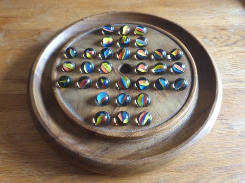
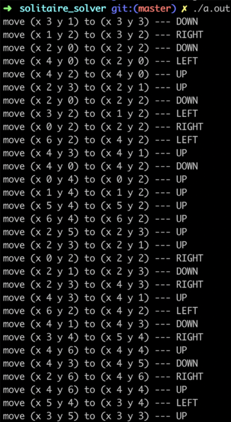
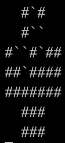

# peg_solitaire_solver
Recently, I discovered the peg solitaire puzzle (english board).

[Peg solitaire page on Wikipedia](https://en.wikipedia.org/wiki/Peg_solitaire)



After quite some attemps, I was close to it but I could not success to solve the puzzle.

Obviously, I did not want to check the solution on internet. So I challenged myself to find it with my own backtracking solver.

### Usage

```
gcc solver.c
```
Note : using char type for solver fonction parameters will give compilation warnings when compiling with -Wall flag as we use them as array indexes but I think it is more efficient like this to avoid too much stack memory usage as this function will be recursively called many times (parameters value will never exceed 31).
```
./a.out [-v d] [-s x y] [-e x y]
```
- -v (visual) option prints on the console the moves the solver is trying to make in real time (d is the delay in microseconds between two move attemps). It will of course considerably slow the solver.
- -s (start) option let the user choose the starting point of the puzzle (x and y, between 0 and 6, are the coordinates of the point). Default starting point is the middle point (x = 3, y = 3).  
- -e (end) option let the user choose the position he wants the last ball to be at the end of the puzzle (with same x and y coordinates as start option above).

### Output

The solver is pretty slow to execute (~5 minutes without options on 19 school computers), but here is the solution it gave me :



Here is as well a quick example of visual mode :


